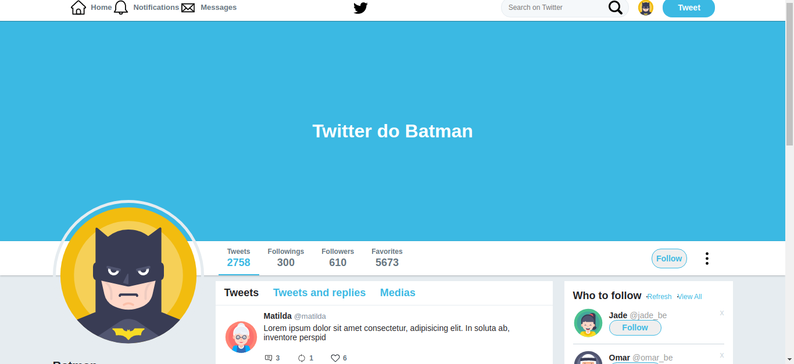
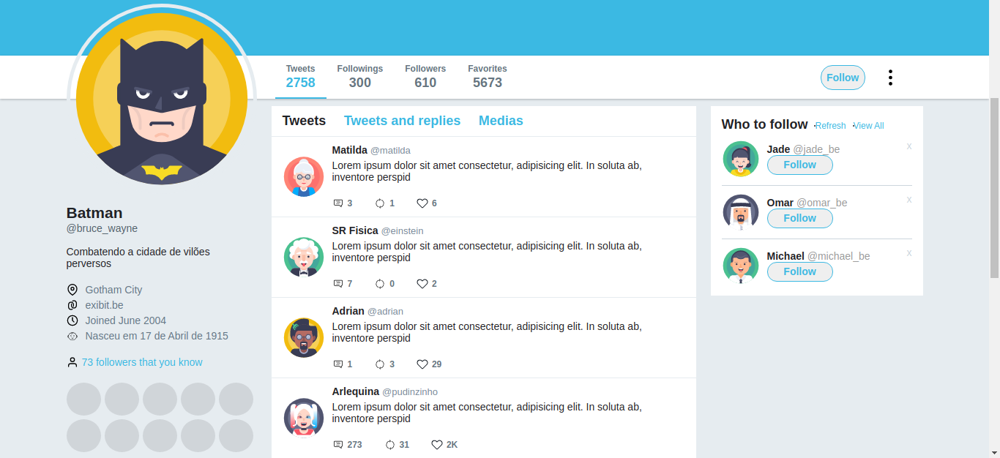
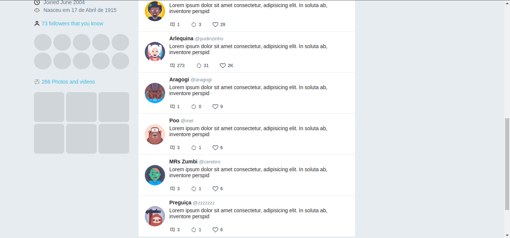

# Aplicação:

[Twitter](taret="https://jessica-twitter-clone.netlify.app/") 

### **Flexbox**

-- Estiliza aplicações, usado para responsividades

-- display flex alinha os itens horizontalmente em forma de row

**flex-direction:**

- direção da coluna 

- row: linha

- column: coluna

- reverse: muda a direção(direita->esquerda) (baixo->cima)

**align-items(vertical):**

- flex-start: inicio

- flex-end: fim

- center: centro

**justify-content(horizontal):**

- space-between: espaço igual entre os elementos

- space-around: espaço entre os elementos com espaços no inicio e fim

**flex-grow:**

- aumenta conforme a dimensão da tela

**flex-shrink:**

- diminui conforme a dimensão da tela

**flex:**

- primeiro atributo corresponde ao grow

- segundo atributo ao shrink

- terceiro atributo ao basis que atribui um valor padrão do elemento

**flex-wrap:**

- quebra de linhas

- wrap: possui quebra de linhas

- no-wrap: não quebra linhas

**align-content:**

- é como se os componentes tivessem uma box em volta deles, por meio dessa propriedade se pode escolher como os componentes vão se comportar

**order:**

- para saber a ordem de cada componente

**padding:**

-- Quando possui um valor:

- atribui para todos os lado

-- Quando possui dois valor:

- primeiro valor: vertical

- segundo valor: horizontal

-- Quando possui 3 valores:

- primeiro valor: vertical start

- segundo valor: vertical end

- terceiro valor: horizontal

-- Quando possui 4 valores:

- começa de cima e faz o sentido horário

Quando for codificar opte por criar a estrutura primeiro, só depois faça a estilização

**box-shadow:**

- primeiro valor: quantos px pra direita a box-shadow vai se posicionar

- segundo valor: quantos px no sentido vertical a box-shadow vai se posicionar

- terceiro valor: quantos px ela vai se dissipar para a tela

- quarto valor: cor

**::after:**

- precisa obrigatoriamente ter um content, posso declarar ele sendo nulo `content:'';`

**flex-basis:**

- tamanho padrão do elemento

**:first-child:**

- se tiver 5 tags img a estilização só irá ser atribuida no primeiro filho, ou seja, na primeira tag
